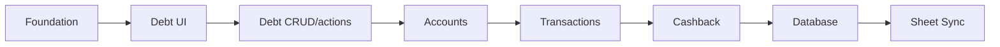

# Roadmap

| Step | Milestone | Status |
|------|-----------|--------|
| 1 | Foundation — repo, shell, mock data | ✅ **Now** |
| 2 | Debt UI — list, status badges, person links | 🔜 Next |
| 3 | Debt CRUD — create, edit, pay, delete | 🔜 Next+1 |
| 4 | Account management — list, balances | 📅 |
| 5 | Transaction tracking — add, categorize | 📅 |
| 6 | Cashback detection & tracking | 📅 |
| 7 | Real database (Neon/Postgres) | 📅 |
| 8 | Google Sheets sync | 📅 |

Each milestone is a self-contained PR-ready increment.
